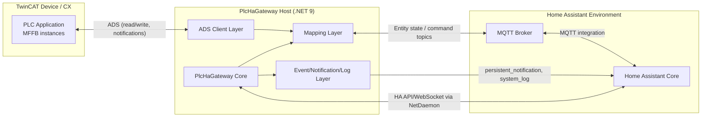

# PlcHaGateway

## Overview

PlcHaGateway is a NetDaemon 5 application (running on .NET 9) that bridges a TwinCAT PLC and Home Assistant.
It reads and writes PLC symbols via ADS, creates and synchronizes Home Assistant entities via MQTT discovery/topics,
and handles event/notification/log integrations through Home Assistant services.

This repository contains both:

- the C# gateway runtime (`source/PlcHaGateway`), and
- the TwinCAT mini framework library (`source/Tc3_MiniFrame`) that provides the PLC-side function blocks (MFFB).

## Topology



## Tc3_MiniFrame

**TwinCAT library** that provides a very basic framework to lineup on a "standard" set of POUs and to provide some primitive functionality.

### Function Blocks

There are several _mini framework function blocks_ (MFFB) in the `Tc3_MiniFrame` library that can be used to create mappings:

#### Objects

- `FB_Mfr_AI` | Analog input
- `FB_Mfr_AO` | Analog output
- `FB_Mfr_AVal` | Analog value for display
- `FB_Mfr_AValOp` | Analog value for operation

- `FB_Mfr_BI` | Binary input
- `FB_Mfr_BO` | Binary output
- `FB_Mfr_BVal` | Binary value for display
- `FB_Mfr_BValOp` | Binary value for operation

- `FB_Mfr_MVal` | Multistate value for display
- `FB_Mfr_MValOp` | Multistate value for operation

- `FB_Mfr_View` | View

  Should be used when aggregating MFFB's.

#### Events

- `FB_Mfr_Event` | Event mapped to Home Assistant persistent notification (active + acknowledge)
- `FB_Mfr_Notification` | Fire-and-forget Home Assistant persistent notification
- `FB_Mfr_Log` | Home Assistant system log write

#### Services

- `FB_Mfr_Weather` | Weather service container with bundled weather entities and notifications
- `FB_Mfr_WeatherNow` | Current weather service data
- `FB_Mfr_WeatherForecast` | Forecast weather service data

#### Virtual device

The top most view is automatically considered a _virtual device_ wich will be mapped as such to the MQTT integration!
It will group all nested MFFB's.

### Attributes

Decorate the declared function blocks with the following attributes to associate it with the desired _Home Assistant entity_.

Once created, a mapping will be used to keep the symbol and entity synchronous.

[Operational function blocks](#function-blocks) will be synchronized from _Home Assistant_ to _TwinCAT PLC_ and vice versa.
All other [operational function blocks](#function-blocks) will synchronize from _TwinCAT PLC_ to _Home Assistant_ only!

#### Mapping

Creates a mapping between _PLC variable_ and _HA entity_.

**Syntax:** 

- Map some **native** entity:

  Specify the full qualified path, including the [domain](https://www.home-assistant.io/docs/configuration/entities_domains/#domains), of the target entity.

  `{attribute 'PlcHa.Mapping' := 'domain.haEntity_path'}`

  > Use this mapping when binding to some **existing entity** wich may be part of some [integration](https://www.home-assistant.io/integrations) (e.g. [sun](https://www.home-assistant.io/integrations/sun)).

  > [Physical MFFB's](#function-blocks) (e.g. `FB_Mfr_AO` or `FB_Mfr_BI`) are not allowed for _native_ mappings!

- Map some **relative** entity:

  Specify the entity path.

  `{attribute 'PlcHa.Mapping' := 'haEntity_path'}`

  When aggregating at least two [MFFB's](#function-blocks) (e.g. `FB_Mfr_View`.`FB_Mfr_BI`) the resulting entity's **full qualified path will be concatenated** from all the aggregated [MFFB's](#function-blocks) _mapping_ attribute decorations.
  
  > The entities [domain](https://www.home-assistant.io/docs/configuration/entities_domains/#domains) will be infered from the [MFFB](#function-blocks) type used.

#### Name

Specifies a mapped entities _friendly name_.

- **Syntax:** `{attribute 'PlcHa.Name' := 'name'}`
- **Use-cases:**
  All entities, wich are in case all [MFFB's](#function-blocks), but `FB_Mfr_View`.
  Only exception is the [virtul device view](#virtual-device).

> This attribute is mandatory!
  If omitted, the [MFFB's](#function-blocks) instance name will be used as fallback.

#### Model

Specifies a mapped devices _model name_.

- **Syntax:** `{attribute 'PlcHa.Model' := 'model'}`
- **Use-cases:** [virtul device](#virtual-device)

> This attribute is mandatory!
  If omitted, the _TwinCAT_ project name will be used as fallback.

#### Manufacturer

Specifies a mapped devices _manufacturer name_.

- **Syntax:** `{attribute 'PlcHa.Manufacturer' := 'manufacturer'}`
- **Use-cases:** [virtul device](#virtual-device)

> This attribute is optional.

#### Version

Specifies a mapped devices _version_.

- **Syntax:** `{attribute 'PlcHa.Version' := 'version'}`
- **Use-cases:** [virtul device](#virtual-device)

> This attribute is optional.
  If omitted, but a [global version structure](https://infosys.beckhoff.com/english.php?content=../content/1033/tc3_plc_intro/714823819.html&id=) was declared within the _TwinCAT_ it will be used as fallback.

#### Enum

Specifies a [multistate mapping's](#function-blocks) enumeration type.
Each entitie's state is mapped to it's distinct PLC context counter part.

- **Syntax:** `{attribute 'PlcHa.Enum' := 'plc_enum_datatype'}`
- **Use-cases:** `FB_Mfr_MVal`, `FB_Mfr_MValOp`

#### Icon

Specifies an explicit Home Assistant icon for the mapped entity.

- **Syntax:** `{attribute 'PlcHa.Icon' := 'mdi:icon-name'}`
- **Use-cases:** Any mapped entity where the default icon should be overridden.

Icon conventions:

- Use canonical Material Design Icons names with `mdi:` prefix and lowercase kebab-case.
- Validate in the Home Assistant icon picker first (HA can lag behind latest MDI release).
- Avoid placeholders or ambiguous aliases; prefer explicit semantic names.


## PlcHa Gateway Runtime

**C# daemon** that connects _Home Assistant_ and _TwinCAT PLC_ for synchronization of process data at runtime.

### Entity configuration generator

TODO: creates a `*.yaml` of all MFFB's, found in PLC.

TODO: multistate entity:
state are generated from the enum DataType. but only state that begins with capital letters!
e.g. `invalid` or `_invalid` will be ignored.

### Development

For _visual studio code_ create a `appsettings.Development.json` file to maintain developer settings excluded from the git repository:

```
{
    "HomeAssistant": {
        "Host": "__hass_hostName_or_ipAddress__",
        "Port": 8123,
        "Ssl": false,
        "Token": "__hass_api_token__"
    },
    "Plc": {
        "NetId": "127.0.0.1.1.1",
        "Port": 851
    }
}
```
